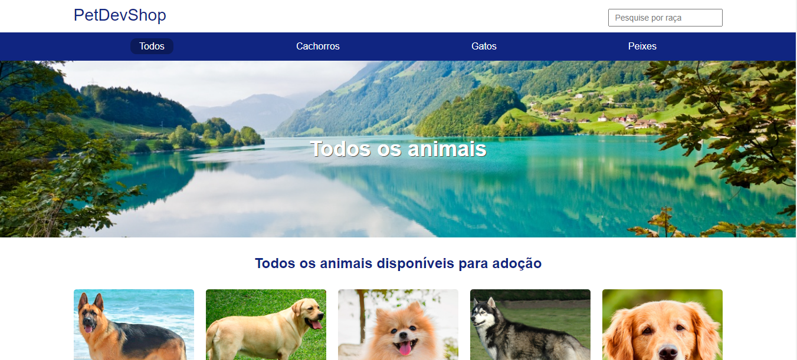
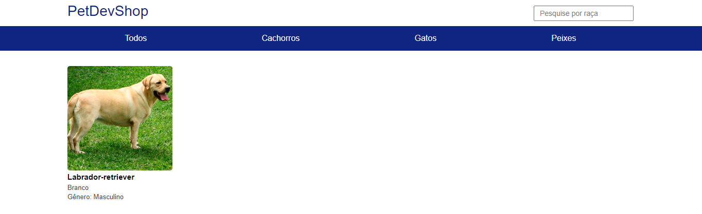

# Pet Dev Shop
[](https://github.com/lucasdevini/pet-dev-shop/blob/main/LICENSE) 

# Sobre o projeto

Node Pet Dev shop é uma aplicação web construída com o intuito de aplicar os conhecimentos aprendidos com as tecnologias Node e Typescript no curso de Node da B7web. O padrão de projeto utilizado foi a estrutura MVC (Model, View, Controller). Model (sem uso de um BD) e Controller foram feitos puramente em TS e View com a view engine Mustache.

A aplicação tem a finalidade de servir como uma vitrine de pets, onde o usuário pode filtrar da maneira que preferir a exibição dos mesmos, seja por espécie ou buscando por um nome de espécie em específico. 

## Layout web




## Funcionalidades
Visualizar os pets da base de dados do projeto de diferentes formas: 
  - Pets no geral;
  - Por espécie;
  - Pesquisando por nome.

# Tecnologias utilizadas
## Back end
- Node.js / TypeScript
## Front end
- Mustache / HTML
# Como executar o projeto na sua máquina

## Pré-requisitos
- Antes de começar, é necessário que você tenha instalado em sua máquina as seguintes ferramentas: Git e Node. Além disso, é interessante ter um editor para melhor visualização dos códigos como o VSCode.

  - link do Git: https://git-scm.com/downloads
  - link do Node: https://nodejs.org/en/download
  - link do VSCode: https://code.visualstudio.com/Download

- Escolha uma pasta para receber os arquivos do projeto (Nesse tutorial usarei a pasta htdocs do xampp).
  
- Além de realizar os passos acima, abra o prompt de comando e digite o seguinte comando para instalar as dependências globais necessárias para rodar o projeto: 

```bash
npm install -g nodemon typescript ts-node
```

## Rodando o projeto
- Abra o Git Bash e digite os seguintes comandos nessa ordem: 

```bash
# Acesse a pasta escolhida para receber os arquivos do projeto:
$ cd C:/xampp/htdocs
```

```bash
# Clone este repositório
$ git clone https://github.com/lucasdevini/pet-dev-shop.git
```

- Abra a pasta do projeto com o VSCode, ou qualquer outro editor de código:
    - abra o prompt integrado (CTRL + ", no VSCode)
    - digite os seguintes comandos nessa ordem:
      
    ```bash
    npm install
    ```
    
    ```bash
    npm start-dev
    ```

- Acesse o seu navegador de preferência e digite o seguinte endereço na barra de URL: *localhost*
    
# Autor

Lucas Vinícius Vieira da Silva